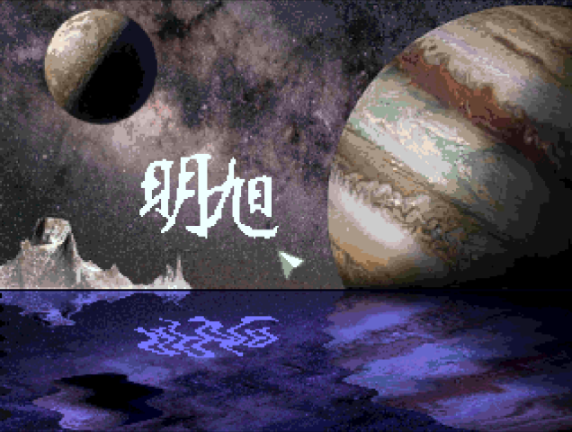

[Amiga 500](https://en.wikipedia.org/wiki/Amiga_500) demo featuring the following technical highlights:
* [Assembly](https://en.wikipedia.org/wiki/Assembly_language) programming on the [Motorola 68000](https://en.wikipedia.org/wiki/Motorola_68000) using several *self-created* [APIs](https://en.wikipedia.org/wiki/API), including a [GIF 87a](https://en.wikipedia.org/wiki/GIF) decoder for importing the image art.
* Efficient use of [bitmaps](https://en.wikipedia.org/wiki/Bitmap) by reusing the six bitplanes of the [extra half-bright mode](https://en.wikipedia.org/wiki/Amiga_Halfbrite_mode) unchanged for the water reflection. This includes a [Copper](https://en.wikipedia.org/wiki/Amiga_Original_Chip_Set#Copper) program as [machine code](https://en.wikipedia.org/wiki/Machine_code) (so-called **Copper list**) that selects the appropriate bitmap line within each [horizontal blank](https://en.wikipedia.org/wiki/Raster_interrupt).
	* At the start, the bitmaps and copper list are set up before reading the image so that you can watch the GIF-decoder's *byte-to-bitmap* conversion (which takes a bit on a *68000*).
* The water reflection includes two further **Copper** effects:
	* Seawaves by [sine](https://en.wikipedia.org/wiki/Sine_and_cosine) cycling the horizontal offset of the water lines. The more the line approaches the horizon, the smaller the amplitude.
	* More gloomy and bluish [color palette](https://en.wikipedia.org/wiki/List_of_color_palettes), set on the horizon.
* The [joystick](https://en.wikipedia.org/wiki/Joystick) input is fetched from the [8520 CIA](https://theamigamuseum.com/the-hardware/cia/) registers and used to move a pointer [sprite](https://en.wikipedia.org/wiki/Sprite_(computer_graphics)) on the upper section. You can even draw by pressing the fire button and moving around. As the bitmaps are reused for the sea, the drawing also appears there.



# How to Start
The easiest way is to put the repository into a mounted directory of an *emulated A500* and to invoke the *executable* which is provided for convenience.
```
cd bin
Demo
```

The sources are also included. Within your *assembly IDE*, you need to assemble `src/Demo` and start it from the `src` folder (relative pathes at work...).

By the way, press the mouse button to stop the demo.
